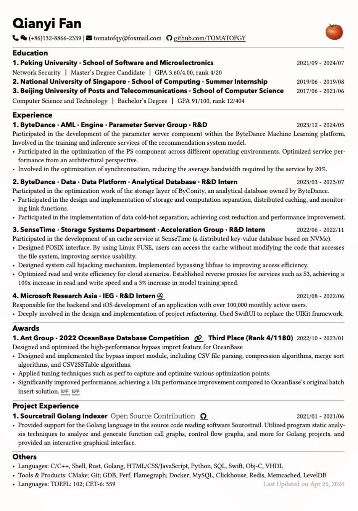

# Chi CV template, but in Typst and Chinese

Rip-off of [rip-off of skyzh's CV, but Typst](https://github.com/matchy233/typst-chi-cv-template) and [rip-off of skyzh's CV in Latex](https://github.com/matchy233/chi-cv-template), adapted for use with Typst and added support for Chinese.

## Usage

You cannot simply compile files by copying them to the web application because Typst's web application DOSE NOT allow uploading of large fonts (unfortunately, Chinese fonts always tend to be too large). However, fortunately, you can achieve real-time previewing locally using the vscode plugin. With plugin, you can easily experience an editing experience far beyond LaTeX.

## Sample Output

CV in English is the original version from Chi Ce, and CV in Chinese is the version I modified.

Life is hard. Good luck. Play good game.