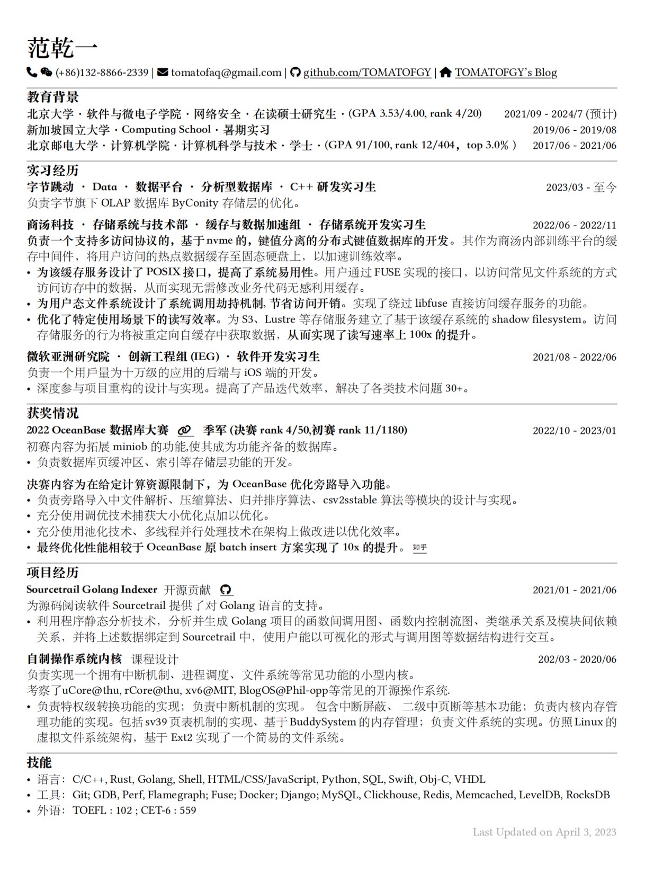

# Chi CV template, but in Typst and Chinese

Rip-off of [rip-off of skyzh's CV, but Typst](https://github.com/matchy233/typst-chi-cv-template) and [rip-off of skyzh's CV](https://github.com/matchy233/chi-cv-template), using [Typst](https://typst.app/).

## Usage

In short, Just Make It.

```bash
make
```
For Chinese:

```bash
make c
```

For English:

```bash
make e
```

You cannot simply compile files by copying them to the web application because Typst's web application does not allow uploading of large fonts (unfortunately, Chinese fonts tend to be too large). However, fortunately, you can achieve real-time previewing locally using the vscode plugin. With Makefile, you can easily experience an editing experience far beyond LaTeX.

## Sample Output




最后,祝大家都成功地令人发指😭.